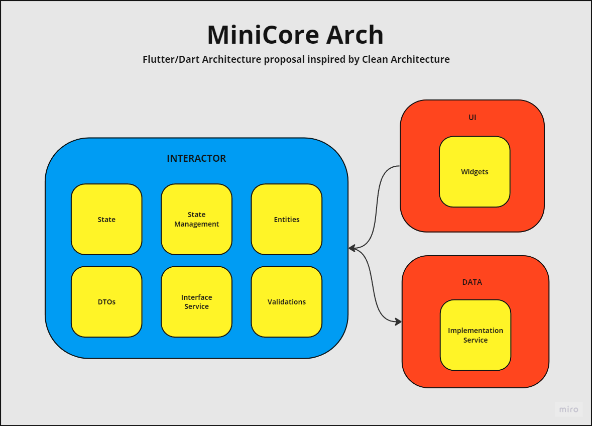
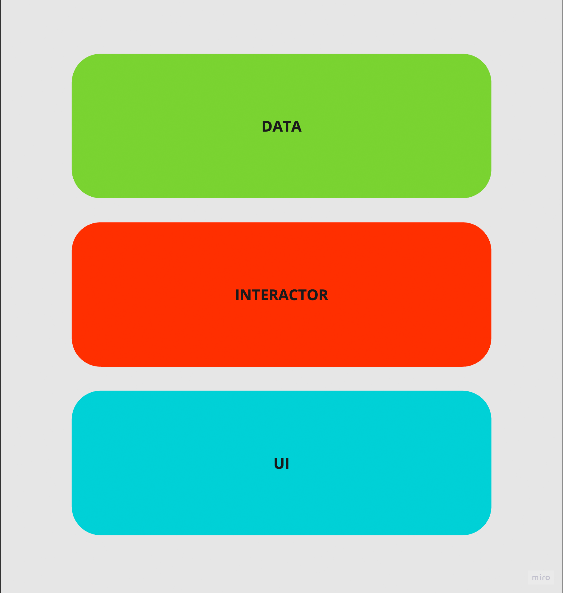

# MiniCore Arch

Flutter/Dart Architecture proposal inspired by Clean Architecture.



##  Clean Dart Proposal

If you need something more robust, try Clean Dart!

- [pt-BR](1.0/README.md)
- [en-US](1.0/README_en.md)

# Start

Using Flutter as an example, we will then have three layers maintaining the “Plugin Architecture”, with the main focus on the State of the Application, which is the layer that hosts the events/actions for state changes.



The Architecture proposal proposes to decouple the outermost layers and preserve the Business Rule.

## UI

The **UI** Layer is responsible for declaring the application's inputs, outputs and interactions.

Using Flutter as an example, we will host the Widgets and Pages, in the backend as an example, it would be in this layer where we would place the Handlers or Commands of our API.

## INTERACTOR

The **Interactor** layer will host the application's Business Rules along with their states.
The core of the layer will be state elaboration and scheduling through some state management approach.

Taking a Repository as an example, we will only have to have the interfaces contract (Abstractions) and the responsibility for implementing this object will have to be transferred to another lower layer.

## DATA

This layer supports the **Interactor** layer by implementing its interfaces. To do this, it adapts external data so that it can fulfill the domain's contracts.

Most likely in this layer we will implement some Repository or Services interface that may or may not depend on external data such as an API or access to some Hardware such as Bluetooth.

In order for the Repository to be able to process and adapt external data, we must create contracts for these services in order to pass the implementation responsibility to the lowest layer of our architecture.

Basically, the **DATA** layer should contain everything that will have a high chance of being changed without the programmer being able to intervene directly in the project.

# Design Patterns

## Isolate Layers - Service

The `Service` pattern will be used for code types that don't have a predefined pattern but need to be separated.

[Service layer pattern documentation](https://en.wikipedia.org/wiki/Service_layer_pattern)

## Dependency Injection

Necessary to apply the Dependency Inversion Principle (DIP).

[Flutterando Video - Dependency Injection](https://www.youtube.com/watch?v=KpPnDHpgHnA)

## State management

In cases of multiple sucessful states the _[State Pattern](https://refactoring.guru/design-patterns/state)_ can be used:

```dart
sealed class UserState {}

final class UnregisteredUserState implements UserState {...}
final class RegisteredUserState implements UserState {...}
```

Use any state management approach to propagate states. Suggestions:

- [ValueNotifier](https://api.flutter.dev/flutter/foundation/ValueNotifier-class.html?gclid=Cj0KCQjwkqSlBhDaARIsAFJANki5MzNFMZ_zHkydtK6igQyyyDdJHteXp3steWclG70LsnJYFiE98JsaAqebEALw_wcB&gclsrc=aw.ds)
- [Triple](https://triple.flutterando.com.br/)
- [ASP](https://github.com/Flutterando/asp)
- [BLoC/Cubit](https://bloclibrary.dev/#/)
- [MobX](https://pub.dev/packages/mobx)
<br>


## Adaptation and conversion

Data types conversion should be made using the `Adapter` pattern.<br>

[Adapter Pattern documentation](https://refactoring.guru/design-patterns/adapter)

<br>

## External API Access (REST OR GRAPHQL)

`Repository Pattern` with `Datasource`.<br>
[Repository Documentation form Microsoft](https://learn.microsoft.com/en-us/dotnet/architecture/microservices/microservice-ddd-cqrs-patterns/infrastructure-persistence-layer-design)
<br>OR<br>

`Gateway Pattern`.<br>
[Martin Fowler Gateway definitions](https://martinfowler.com/articles/gateway-pattern.html)
<br>

## Data Transfer Object

Can be used to transfer data between layers.<br>
[Martin Fowler Text about DTO](https://martinfowler.com/eaaCatalog/dataTransferObject.html)

# Tests

Tests must follow the triple-A pattern (Arrange, Act, Assert).
[Triple-A Article](https://medium.com/@pjbgf/title-testing-code-ocd-and-the-aaa-pattern-df453975ab80)

Example:

```dart
test('should execute a sum correctly', (){

  // arrange
  int number1 = 2;
  int number2 = 1;

  // act
  final result = sumFunction(number1, number2);

  // assert
  expect(result, 3);

});

```

<br>

## Test description

The test description should represent the expected result, according to the action performed.
You should _NOT_ use descriptions that are obvious like, for example, when a result of a list is expected to be a List you have to avoid a description as such: "Should return a `List<Product>` object".

<br>

## Test group

The groups must be named according to the class name, which may or may not be followed by the method.
At the end of the description, you must add " | " (space, pipe, space).

<br>

Store example:

```dart
group('ProductStore | ', (){

    // all ProductStore`s test

});

```

Repository exemple:

```dart

group('ProductRepository.fetchAll | ', (){

    // all ProductRepository.fetchAll`s test

});
```

<br>
<br>

---


# Tips

## Modularize

Obviously we can keep our layers for the entire application but we can get more out of it by creating Interactor, Data and UI layers for each feature. Example:

```
module
├── data
│   ├── datasources
│   └── repositories
├── domain
│   ├── entities
│   └── usecases
└── presenter
    ├── stores
    ├── controllers
    ├── pages
    └── widgets
```

## Think by layer

When developing, start thinking by layer, we shouldn't worry about what's in the **UI** or **DATA** layer at the beginning of the functionality. If we think about the outermost layers, we can end up orienting ourselves (mistakenly) by these layers. Thus, we must get used to developing layer by layer, from the inside out and not the other way around.

Perhaps at the beginning of your "Clean" journey some layers may seem "useless", this happens when our mind is not yet **Thinking in Layers** (or because your Business Rule is too simple for that).

## Unit Testing will be your new UI

It is very common for developers to first create their Views so that they can then "test" the Business Rules. But we already have a proper tool for this and a dedicated place to store these tests.

Developing in a "clean" way is in total synergy with TDD (Test Driven Development) as the UI layer will be one of the last things we will think about in the development of our feature.

# Sign

We appreciate your feedback!

If you agree with the "MiniCore Architecture" proposal, leave a Star on this repository. A Star is the same as signing a "clean manifesto" agreeing with this proposal.

We are open to suggestions and improvements in documentation!
Do this through the issues, our team will be very pleased with your interest in improving this tool for the community.

Feel free to open a PR with corrections to the documentation of this proposal.

# Examples

- [Clean Dart Burgers Cart using BLoC, Cubit, Triple, Asp, MobX, etc](https://github.com/jacobaraujo7/bloc_atom)
- Clean Dart Login with Firebase, MobX and Modular
- [Clean Dart Github Search with BLoC and Modular](https://github.com/Flutterando/clean-dart-search-bloc)
- [Clean Dart Github Search with MobX and Modular](https://github.com/jacobaraujo7/clean-dart-search-mobx)
- [Simple App with MiniCore](https://github.com/viniciusddrft/mini_core_exemple)
- [Todo App with MiniCore](https://github.com/EdsonMello-code/todoapp)

# Links

- [Resumo do livro "Arquitetura Limpa"](https://medium.com/@deividchari/desvendando-a-arquitetura-limpa-de-uncle-bob-3e60d9aa9cce)
- [Sua Arquitetura está limpa?](https://medium.com/flutterando/sua-arquitetura-est%C3%A1-limpa-clean-architecture-no-flutter-458c68fad120)
- [Os tijolos do Clean Architecture](https://www.youtube.com/watch?v=C8mpy3pwqQc)
- [The Clean Code Blog](https://blog.cleancoder.com/uncle-bob/2012/08/13/the-clean-architecture.html)